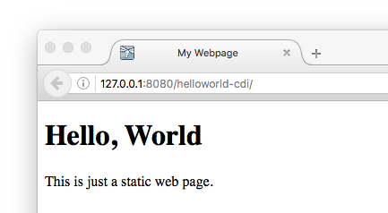
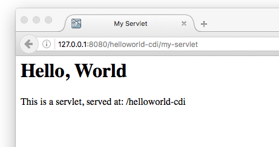
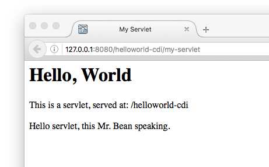

# HelloWorld CDI

A simple dynamic web project that uses servlet and CDI (Context & Dependency Injection).

This example was taken from [helloworld](https://github.com/jboss-developer/jboss-eap-quickstarts/) project from the EJB quickstart page. The application is really simple and you can deploy it directly using `maven` as written in their guideline.

This project shows you how to develop it from scratch using Eclipse Neon and Wildfly 10.

## Creating a dynamic web project

From your Eclipse Neon:

1. Create a new dynamic web project
   * Project name = `helloworld-cdi'
   * Target runtime = `Wildfly 10.0 Runtime`
   * Configuration = `Default configuration for Wildfly 10.0 Runtime`
1. Click **Finish**.

**Note:** You can adjust your application context root to other name. However, for some reasons, Eclipse is so stubborn to create WAR output filename the same as project name, even after we change it explicitly in the Web Project Settings tab. In the end, the web context name will be the same as project name. Unless if you rename the WAR filename manually before deploying.

This registers your URL to `http://127.0.0.1:8080/helloworld-cdi`.

You need to create `index.html` file as a template under the `WebContent` folder. Without this file, you will see *403 Forbidden* message if you open the root URL.

* Right-click your project -> New -> HTML file
* Select WebContent folder and create `index.html`
* You are ready with a template, but just to test your web application, modify `index.html` as follows

```html
<!DOCTYPE html>
<html>
<head>
<meta charset="UTF-8">
<title>My Webpage</title>
</head>
<body>
<h1>Hello, World</h1>
<p>This is just a static web page.</p>
</body>
</html>
```

* Run As -> Run On Server -> select WildFly 10.0
* Open your browser and go to http://127.0.0.1:8080/helloworld-cdi



## Adding a servlet

We are going to create a servlet that dynamically change a webpage.

Before that, we need to create a package:
1. New -> Java package
1. Name: `io.github.avansp.ejb`
1. Click **Finish**.

Create a servlet:
1. New -> Servlet
1. Java package: browse to the new created package.
1. Class name: `HelloServlet`
1. Apply `@SuppressWarnings("serial")` annotation to avoid warning of no UID.
1. You just need to write the `doGet` method.

The `HelloServlet.java` should look like this:
```java
package io.github.avansp.ejb;

import java.io.IOException;
import java.io.PrintWriter;
import javax.servlet.ServletException;
import javax.servlet.annotation.WebServlet;
import javax.servlet.http.HttpServlet;
import javax.servlet.http.HttpServletRequest;
import javax.servlet.http.HttpServletResponse;

@SuppressWarnings("serial")   
@WebServlet("/my-servlet")    // servlet URL
public class HelloServlet extends HttpServlet {

	protected void doGet(HttpServletRequest request, HttpServletResponse response) throws ServletException, IOException {

		response.setContentType("text/html");

		PrintWriter writer = response.getWriter();
		writer.println("<html><head><title>My Servlet</title></head><body>");
		writer.println("<h1>Hello, World</h1>");

		writer.println("<p>This is a servlet, served at: " + request.getContextPath() + "</p>");

		writer.println("</body></html>");
        writer.close();
	}

}
```

Open http://127.0.0.1:8080/helloworld-cdi/my-servlet



Note that the URL is `/helloworld-cdi/my-servlet`. If you open `/helloworld-cdi`, then it will open the previous static `index.html` page. You can refresh `index.html` to open your servlet page automatically by adding
```html
<meta http-equiv="Refresh" content="0; URL=my-servlet">
```
to the header of `index.html` file.

Now open http://127.0.0.1:8080/helloworld-cdi.

Another solution, if your application is the root context, is by renaming the WAR file into `ROOT.war`.

## Add a web bean using CDI

CDI is context and data injection, where we don't have to specify naming context manually for a Java bean.

Preparing your project for Java bean with CDI:
1. Open your project settings.
   1. Select **Project Facets**
   1. Enable "CDI (Contexts and Dependency Injection)"
   1. Click **Apply**
   1. Select "CDI (Contexts and Dependency Injection)" menu item on the left.
   1. Make sure that CDI support is checked.
   1. Click **OK**
1. Create `beans.xml`:
   1. From your project: New -> beans.xml file.
   1. Open folder WebContent -> WEB-INF -> beans.xml
   1. Set property `bean-discovery-made="all"`.

Note that beans must be associated with a name before it can be discovered. At the moment, we set it as `all` to allow discovering all beans.

Create a very simple `HelloService` class that contains a method to get a string:
1. New -> Class
1. Name: `HelloService`

```java
package io.github.avansp.ejb;

public class HelloService {

	String getHelloMessage(String name) {
		return "Hello " + name + ", this Mr. Bean speaking.";
	}

}
```

The idea is to call `getHelloMessage` method from the servlet with CDI.

Modify `HelloServlet`:
1. Import Inject package:
```java
import javax.inject.Inject;
```
1. Inside `HelloServlet` class, insert the injection:
```java
@Inject
HelloService helloService;
```
1. Modify `doGet` method:
```java
protected void doGet(HttpServletRequest request, HttpServletResponse response) throws ServletException, IOException {

    response.setContentType("text/html");

    PrintWriter writer = response.getWriter();
    writer.println("<html><head><title>My Servlet</title></head><body>");
    writer.println("<h1>Hello, World</h1>");

    writer.println("<p>This is a servlet, served at: " + request.getContextPath() + "</p>");

    writer.println("<p>" + helloService.getHelloMessage("servlet") + "</p>");

    writer.println("</body></html>");
    writer.close();
}
```

Open again http://127.0.0.1:8080/helloworld-cdi


